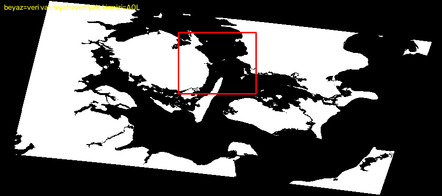

# GeoPort AI

**Storebælt (Danimarka) boğazında Sentinel-1 SAR ve AIS verilerini birleştirerek
deniz trafiği analizi ve karanlık gemi (dark vessel) tespiti.**

> **Durum: duraklatıldı (2026-08-02).** SAR hattında kök neden analizi tamamlandı
> ve nedeni bulundu. Proje, AIS tabanlı analiz eksenine kaydırılıyor —
> gerekçe ve yol haritası: [`PLAN_V2.md`](PLAN_V2.md)

---

## Bu depo neyi anlatıyor

Kurulmuş bir hat vardı: Sentinel-1 SAR sahnelerinden YOLO-OBB ve CFAR ile gemi
tespiti, AIS ile eşleştirme, eşleşmeyenleri "karanlık gemi" olarak raporlama.

Hat çalışıyordu. **Ürettiği sayılar doğru değildi.**

Bu depo, o sayıların neden yanlış olduğunun bulunma sürecidir. Sonuç tek bir
yapılandırma satırında bitiyor — ama oraya varmak sekiz ayrı ölçüm gerektirdi.

---

## Kök neden

```xml
<!-- data/sentinel1/myGraph.xml — SNAP Terrain-Correction -->
<nodataValueAtSea>true</nodataValueAtSea>
```

SNAP'in Range-Doppler Terrain Correction adımı, yükseklik modelini (SRTM)
kullanarak **deniz piksellerini "veri yok" olarak siler**. Bu SNAP'in varsayılan
davranışıdır ve kara uygulamaları için mantıklıdır.

Gemi tespiti projesinde ise **aranan her şeyi silmek** anlamına gelir.



*Beyaz = geçerli veri, siyah = veri yok, kırmızı kutu = ilgi alanı (AOI).
Beyaz bölgeler Danimarka'nın kara parçalarıdır — Fyn, Sjælland, Jylland.
Denizin tamamı silinmiş.*

### Hata neden fark edilmedi

`02_preprocessing/normalize_sar.py` maskeyi aşağı taşıyamadı. Kaynak ENVI `.img`
dosyasında nodata etiketi olmadığı için `src.read_masks()` her pikseli "geçerli"
döndürdü, dolayısıyla nodata sıfırlama satırı hiç çalışmadı:

```python
src_mask = src.read_masks(1, window=window)   # her zaman 255 döndü
normalized[src_mask == 0] = 0                 # hiç tetiklenmedi
```

Sonuç: uydunun hiç görüntülemediği deniz, çıktıda `0` (veri yok) yerine `1`
(çok karanlık su) oldu. Hattaki hiçbir adım denizin eksik olduğunu anlayamadı.

---

## Ölçümler

Her iddia koddan bağımsız olarak ölçüldü. Scriptler [`scripts/`](scripts/) altında.

| Ölçüm | Sonuç |
|---|---|
| AOI'nin gerçek veriyle kapsanması (10 sahne) | **hiçbiri %40'ı geçmiyor**, biri %0 |
| Hiç görüntülenmiş AIS gemisi | **460 / 1308 = %35** |
| Görüntülenmiş gemilerde YOLO'nun <300 m tespiti | **%0** (100 m+ gemilerde bile) |
| Eşleşen gemilerin AIS'e ortalama uzaklığı | 1355 m |

Son satır tek başına bir uyarıydı: 10 m çözünürlüklü bir sensörde 1,3 km'lik
"eşleşme" eşleşme değildir.

### Belirti ile neden ayrımı

Kök neden bulunmadan önce ölçülen sorunların bir kısmı gerçek, bir kısmı
bu tek nedenin aşağı akış belirtisiydi. Ayrımı yapmak önemliydi:

| Bulgu | Sınıf |
|---|---|
| CFAR karo başına 13,3 yanlış alarm | belirti — yalnızca kara üzerinde çalışıyordu |
| Eşleşme mesafesi 1355 m | belirti — en yakın "tespit" hep en yakın kıyıydı |
| %5 recall | belirti — denizde veri yoktu |
| Etiketlerin %70'i dejenere (kısa kenar < 1,5 px) | **bağımsız** — AIS'in %52'si 20 m altı gemi |
| `CFAR_MAX_CLUSTER_SIZE = 30 px` | **bağımsız** — 244 m'lik gemi ~180 px küme üretir, filtre onu reddediyordu |
| Anizotropik piksel (5,69 m × 10,00 m) | **bağımsız** — SNAP 10 m'yi dereceye çevirirken enlem düzeltmesi yapmamış |
| Üretim modeli harici veri setiyle eğitilmiş | **bağımsız** — `mAP50 = 0.888` bu projenin verisine ait değil |
| Tüm YOLO-OBB eğitimlerinde `loss = 0`, `mAP = 0` | **bağımsız** — dataloader hiç etiket görmedi |

---

## Yapılan iş

### Faz 0 — zemin sabitleme *(tamamlandı)*

Algoritma mantığına dokunmadan tekrarlanabilirliği geri kazandırma.

- **`config.py` tek parametre kaynağı oldu.** CFAR parametreleri daha önce hem
  `config.py` hem `cfar_detector.py` içinde **farklı değerlerle** tanımlıydı —
  "bir hatayı düzeltince başkası çıkıyor" döngüsünün teknik sebebi buydu.
- **`geoport/obb.py`** — silinmiş `compute_ship_obb.py` tersine mühendislikle
  çözülüp yeniden yazıldı. Doğrulama: **1308/1308 poligon, Hausdorff sapması
  0,0000 m** ([`scripts/verify_obb_reproduction.py`](scripts/verify_obb_reproduction.py)).
- **Güvenilmez çıktılar arşivlendi**, silinmedi — teşhis kanıtı olarak duruyorlar.
- **9 scripte açık bariyer kondu.** Sebep: `config`'i import etmeyen scriptler,
  config'ten isim kaldırılınca durmuyor, sessizce eski sabitlerle çalışmaya
  devam ediyordu. Her bariyer neden kapatıldığını ve hangi fazda neyle
  değişeceğini söylüyor.
- **Git hijyeni:** 145 takipli binary → 0.

Ayrıntı: [`reports/FAZ_0_RAPOR.md`](reports/FAZ_0_RAPOR.md)

### Teşhis araçları

| Script | Ne yapar |
|---|---|
| [`diagnose_match_distance.py`](scripts/diagnose_match_distance.py) | AIS → en yakın SAR tespiti mesafe dağılımı (eşik uygulamadan) |
| [`diagnose_ship_visibility.py`](scripts/diagnose_ship_visibility.py) | Gemi görüntüde var mı, ofset sistematik mi |
| [`dump_ship_chips.py`](scripts/dump_ship_chips.py) | En büyük gemilerin görüntü kesitleri — gözle doğrulama |
| [`validate_ais_features.py`](scripts/validate_ais_features.py) | AIS veri setinin hangi analizleri taşıdığı |
| [`verify_obb_reproduction.py`](scripts/verify_obb_reproduction.py) | Faz 0 doğrulama kapısı |

---

## Neden burada duruldu

SAR hattının düzeltilmesi teknik olarak **bir XML satırı**: `nodataValueAtSea`
değerini `false` yapıp SNAP'i yeniden çalıştırmak. Ham `.SAFE.zip` dosyaları
duruyor, yeniden indirme gerekmiyor.

Ama sonrasında belirsizlik var: deniz verisi geldiğinde modelin gemileri bulup
bulamayacağı test edilmedi — **edilemedi**, çünkü bakılacak deniz yoktu.

Buna karşılık elde **bugün çalışan** bir veri kaynağı var:

| | |
|---|---|
| AIS kaydı | 17.142.606 |
| Benzersiz gemi | 3.290 (1.424 tanesi ≥30 m) |
| Süre | 45 gün (2026-05-01 → 06-15) |
| Çözünürlük | **saniyelik** |

Bu yüzden proje AIS eksenine kaydırıldı. SAR **iptal edilmedi, ertelendi** —
`PLAN_V2.md` içinde P7 olarak duruyor ve `geoport/obb.py` onun için hazır.

---

## Sonraki adım

[`PLAN_V2.md`](PLAN_V2.md) — tek bir yörünge motoru üzerine kurulu dört analiz
katmanı: karşılaşma riski (CPA/TCPA), AIS boşluk/anomali tespiti,
bekleme/tıkanıklık, karbon salımı.

Fizibilite ölçüldü, iki metodolojik tuzak tespit edildi ve plana yazıldı:

- **"İmkânsız hız" spoofing değil, alıcı gürültüsü.** 3 günde 262 geminin
  262'sinde çıkıyor — yani sinyal değil, taban gürültü.
- **Karşılaşma sayıları rıhtımdaki gemilerle şişiyor.** 62.801 yakınlaşma anı,
  ama yalnızca 221 benzersiz çift.

---

## Depo yapısı

```
config.py                 tek parametre kaynağı
geoport/                  ortak kütüphane
  obb.py                  AIS kaydı → yönlü sınırlayıcı kutu
01_data_collection/       veri indirme (AIS, Sentinel-1, kara maskesi)
02_preprocessing/         normalizasyon, karolama
03_training/              YOLO eğitimi
04_inference/             CFAR + YOLO tespit
05_analysis/              AIS eşleştirme, karanlık gemi motoru
dashboard/                FastAPI + harita arayüzü
scripts/                  teşhis ve doğrulama araçları
reports/                  faz raporları ve ölçüm çıktıları
TECHNICAL_PLAN.md         SAR hattı planı (P7'ye ertelendi)
PLAN_V2.md                AIS ekseni planı (aktif)
```

`01_`–`05_` altındaki scriptlerin çoğu şu an **bilinçli olarak bariyerli** —
eski, doğrulanmamış sonuçların kazara yeniden üretilmesini engellemek için.
Her biri çalıştırıldığında neden kapatıldığını açıklar.

---

## Çalışma ilkeleri

Bu projede işe yarayan ve devam ettirilen dört ilke:

1. **Önce ölç, sonra inşa et.** Hattı haftalarca yeniden inşa etmekten bu ilke
   kurtardı — düzeltilmiş bir hattı boş denizin üzerinde çalıştıracaktık.
2. **Tek parametre kaynağı.** `config.py` dışında sabit tanımlanmaz.
3. **Her fazın sonunda ölçülebilir doğrulama kapısı.** Kapı geçilmeden ilerlenmez.
4. **Belirsizliği gizleme.** Tahmin olan şey tahmin diye sunulur.

---

## Kurulum

```bash
python -m venv venv
venv/Scripts/activate          # Linux/macOS: source venv/bin/activate
pip install -r requirements.txt
```

GPU'lu PyTorch (SAR modülü için):

```bash
pip install torch==2.5.1 torchvision==0.20.1 \
    --index-url https://download.pytorch.org/whl/cu121
```

Veri (`data/`), model ağırlıkları (`runs/`, `*.pt`) ve arşiv depoya dahil değildir.
